# 1.仓库建立


这里我发现了一种方法，可以先git clone这个os仓库，然后再去除他的标记，然后自己建立自己的仓库？但是有个问题，所有的lab都是在remote branch上面的，所以我们要用一个很巧妙的方法： 

比如可以拆分成两部分：

1.先做独立的实验

2.把做出来的独立实验的commit保存在本地分支，然后用git copy之类的指令，把这个实验拷贝到另一个文件夹，然后再去掉标记，再重新建立仓库并推送至远程仓库

# 2.开始试验

## 1.lab util


### 1.1 sleep done

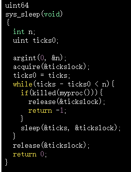

syscall sleep

edit makefile about: UPROGS to active "sleep" function

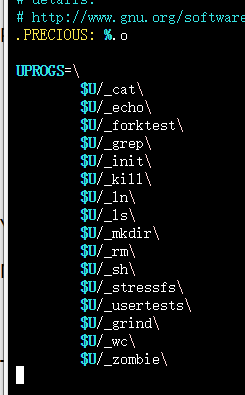


1.第一个难点： 传入命令行参数；  echo.c, grep.c 是怎么做的？

包括几点： 没有正确传参，正确传参—>会用user/ulib.c的atoi，将命令行传入的string->int

**答：** 可以简单的理解为： 如果在shell中输入sleep 10，那在argv就会接受到2，然后args是"sleep"跟"10"的两部分组成；

2.如何实现sleep？sleep可能是以时间间隔为单位的： sleep 10， 停止10个时间片

看一下sysproc.c：是sleep的实现； user/user.h这里，这个头文件写了syscall的原型： int fork... int sleep(int)。这里就相当于：process ->use syscall: 具体形式就是 在process的代码里面用: a=sleep(10)，然后user/usys.S RISC-V的assembler就会帮忙跳转到kernel里面 for sleep

最后main:call exit(0)

写完之后，要在Makefile的UPROGS 里面加入sleep程序->make之后就可以在xv6 shell使用他了

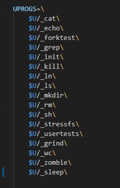

就这么轻飘飘的加一行即可！

这就是总体流程

**但是要用什么样的函数来描述呢？是int main 来做？还是仅仅只写一个int sleep?谁来控制它？当输入在命令行sleep 10 之后，应该是怎样的操作？**

**就像在命令行输入echo 一样，shell是怎么运行的？**（上面回答了）

理解了，我只需要调用user.h的sleep函数即可，所以我就是写一个main函数就好啦，这个main函数就负责记录shell的输入，我处理输入即可

那问题来了，如何处理输入？

char** argv的格式是怎样的？

从echo中看，似乎是从argv[1]开始记录的？（是的！上面回答了！在这里相当于echo只实现了功能，其判断是由上级shell实现的：即argv[0]是否等于echo

```c
#include "kernel/types.h"
#include "kernel/stat.h"
#include "user/user.h"

int
main(int argc, char *argv[])
{
  int i;

  for(i = 1; i < argc; i++){
    write(1, argv[i], strlen(argv[i]));
    if(i + 1 < argc){
      write(1, " ", 1);
    } else {
      write(1, "\n", 1);
    }
  }
  exit(0);
}

这里可以看到： 从argc可以知道命令行读了几段字符进来，然后用一个for循环控制这个输出，其中write(1,argv[i],strlen(argv[i]))就代表：
1：代表标准输出流； argv[i]代表这个是第i个字符串,然后取出字符串，以及记录他对应的大小，然后传递给write
write(约定俗成的：1， 然后字符串内容，字符串大小)
由于argv是一个char** 即：字符串指针，他可以储存N个字符串
如果说这个char[i]后一个位置还有字符的话，下一个输出是空格；如果后面啥都没有了的话，就输出换行符，结束啦
```

所以可以得到启发，这个数组argv[] 从数组下标为1开始

后续的user space->kernel space都是让系统帮我完成

但是问题来了，好像真正的难点是在Makefile这里，怎么我写的这个文件没法通过编译啊？->没有，是我库文件弄错啦！首先报错了这样：

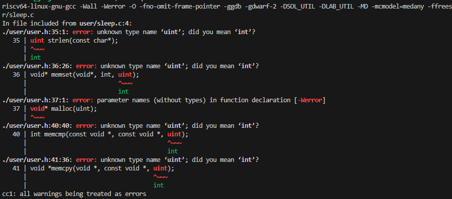

我说咋回事儿捏？怎么在编译这个文件的时候就说不认识void*, uint捏？结果：害！人家都加了头文件kernel/types.h，我没加！

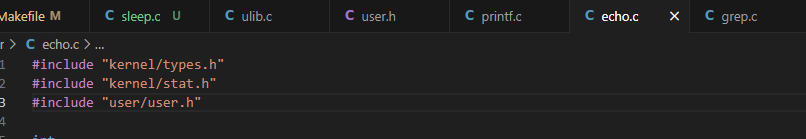

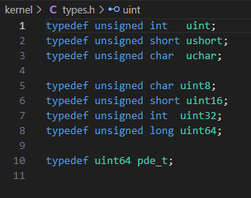

相当于这里有一个简易版的定义！然后就屁颠屁颠的加上咯！然后出现什么错呢？然后出了重定义的错误！

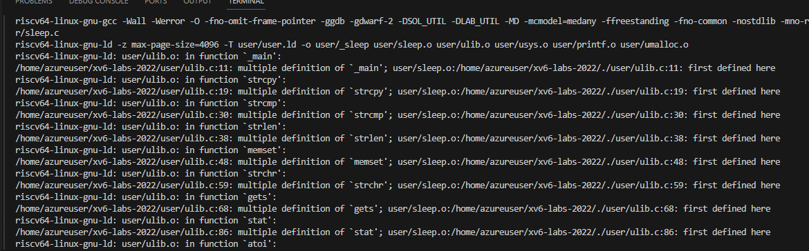

报错如上，就是说我重新定义这个ulib.c啦！发现：哦！这个只是ulib.c的实现文件而已！我应该引用头文件： user.h

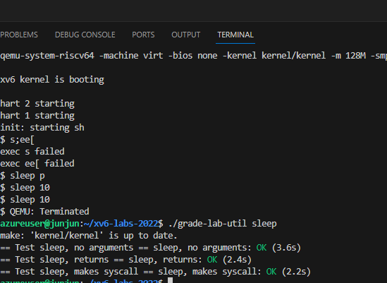

对的对的对的！！！就是这样！！！


### 1.2 pingpong 

首先是如何使用pipe?

A->B 

read from the pipe!


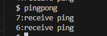

结果很奇怪，都是收到的ping，为什么呢？

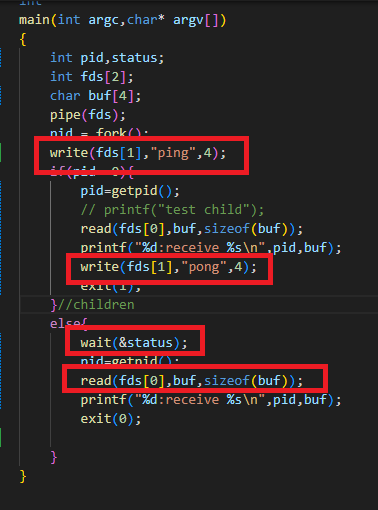

明明子进程是向管道写的，为什么大家还是只会读ping？

另外，可以看到 pipe的写法： 还是[0]是读，[1]是写；这可能就是约定速成

**好像是因为我没有关闭管道导致的这个错误**


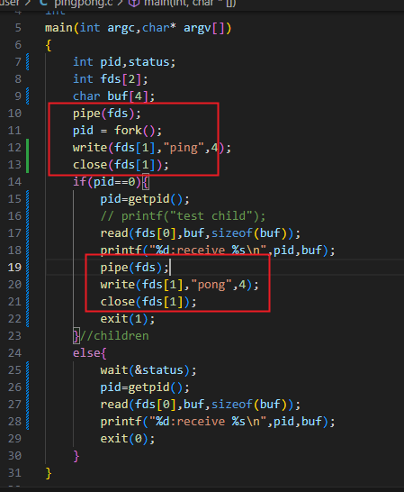

这也是错的，还是会收到ping

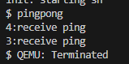


怎么办呢？

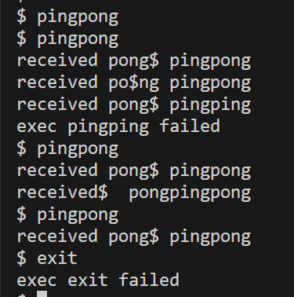

代码像这样的时候：

```c
if(pid==0){
read(fds[0],buf,sizeof(buf));
        // close(1);
        char* buf1="pong";
        // write(fds[1],buf1,sizeof(buf1));
        write(fds[1],"pong",4);
        printf("received %s",buf1);
        exit(0);
    }//children
    else{
        close(1);
        write(fds[1],"ping",4);
        // printf("wait read---parent");
        close(0);
        read(fds[0],buf,sizeof(buf));
        printf("received %s",buf);
        exit(0);
    }
```

最开始是像这样的：我在思考：read是否具有同步性？他需要等待write执行完然后才会执行吗（相当于一个隐含的信号量机制？）；还是说他只是按序执行：即1.先执行read后执行write那这个buf就啥都没有；2.先执行write后执行read，buf读入ping

在这里： fork操作能够保证int fds[2]对于父子进程是一致的，相当于dup操作了，他们是在操作同一份文件

```c
write(fds[1],"ping",4);
    if(pid==0){
        read(fds[0],buf,sizeof(buf)); 直接读
        write(fds[1],"pong",4);
        printf("received %s\n",buf);
        exit(0);
    }//children
    else{
        // close(1);
        // printf("3:write---parent\n");
        wait(0);
        close(0);
        read(fds[0],buf,sizeof(buf));
        // printf("4:read---parent\n");

        printf("received %s\n",buf);
        exit(0);
    }
改变思路，我这样呢？我在父进程fork之前我就先把内容写入缓存池，那这样对于子进程而言，read一上来就能读，然后父进程这边写个等待，确定顺序一定是：先是child，再是parent，做一个异步操作，但是为什么会读出来两个ping呢？
```

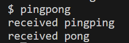

原来是这里！fork()之后，子进程就创建出来了，那他也会写一个ping进去！所以在管道里面就有两个ping！

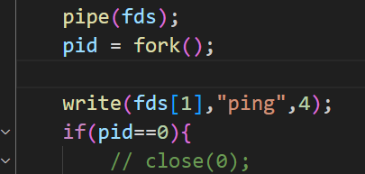

调整一下位置就好啦~

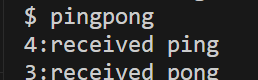

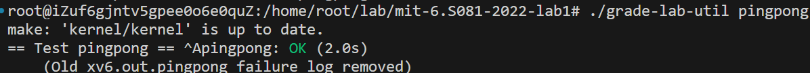

测试点通过~

### 1.3primes


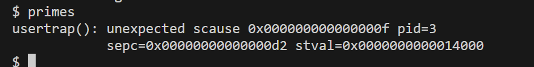

如果我直接在这个框架下使用2-35进行pick的话，会溢出？（哦，我main函数好像有点问题，

```c

void 
pick(int *a,int n){
    if(n==1&&a[0]!=0){
        exit(0);
    }
    else{
    printf("prime %d\n",*a);
   int* b=malloc(sizeof(int)*n);//好像int b[n]这种写法会报错
   int j=0;
    for(int i=1;i<=n-1;i++){
        if(a[i]%a[0]!=0){//不是a[0]的倍数的话，就记录下来
            b[j++]=a[i];
        }
    }
    pick(b,j);
} 
}
```

如果值控制在2-9好像可以正确识别？

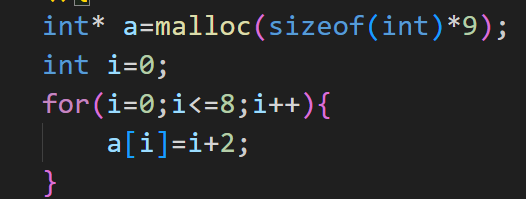

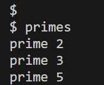

哦不，好像只能识别到5？

如果我初始化一个：[2,36]的数组的话，好像31不能被识别（即递归出口这个没有被正确识别）

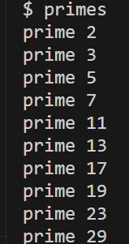


加一行代码即实现：

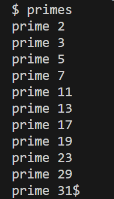

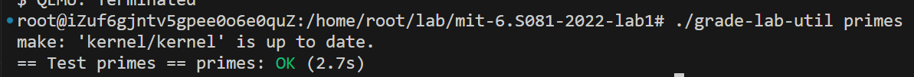

每次进入递归都是一个新的数组，把所有不是a[0]倍数的元素全部记入b[]数组并且用j标号，再次让 b[],j进入循环并且迭代


done！但我好像没有用到pipe。。。。汗颜

他要求的任务点是：

Your goal is to use `pipe` and `fork` to set up the pipeline. The first process feeds the numbers 2 through 35 into the pipeline. For each prime number, you will arrange to create one process that reads from its left neighbor over a pipe and writes to its right neighbor over another pipe. Since xv6 has limited number of file descriptors and processes, the first process can stop at 35.

要用pipe跟fork来完成这个操作。。。

如果要使用管道的话？应该怎么做呢？管道

Close[0]关闭


父进程处理什么？整体规划

子进程处理什么？第一个不能整除的数


他们怎么通信？通过pipe

在学习一下


相当于： 你在写端传入int， 在读端就读int

```c
 //   child:  
假设：传入 a[10];
write(fd[1],&a[0],sizeof(a[0]));
相当于这里写入的是内存块的地址
//		parent:
int tmp;
read(fd[0],&tmp,4);
```

在宏观上保持这样的行为：父进程负责打印第一个primes，子进程负责传递

As another example, which Hoare credits to Doug McIlroy, consider the generation of all primes less than a thousand. The sieve of Eratosthenes can be simulated by a pipeline of processes executing the following pseudocode:


```
p = get a number from left neighbor
print p
loop:
    n = get a number from left neighbor
    if (p does not divide n)
        send n to right neighbor
```

A generating process can feed the numbers 2, 3, 4, ..., 1000 into the left end of the pipeline: the first process in the line eliminates the multiples of 2, the second eliminates the multiples of 3, the third eliminates the multiples of 5, and so on:


The linear pipeline nature of the examples thus far is misrepresentative of the general nature of CSP, but even restricted to linear pipelines, the model is quite powerful. The power has been forcefully demonstrated by the success of the filter-and-pipeline approach for which the Unix operating system is well known [[2\]](https://swtch.com/~rsc/thread/#2) Indeed, pipelines predate Hoare's paper. In an internal Bell Labs memo dated October 11, 1964, Doug McIlroy was toying with ideas that would become Unix pipelines: “We should have some ways of coupling programs like garden hose--screw in another segment when it becomes necessary to massage data in another way. This is the way of IO also.” [[3\]](https://swtch.com/~rsc/thread/#3)


P,C share the: first array

C经过遍历找到next array,C->P the print

A打印并传递->B打印并传递

**正确思路：**

```c
//parent:
p = get a number from left neighbor
print p
loop:
    n = get a number from left neighbor
    if (p does not divide n)
        send n to right neighbor
```

应该是这样一个思路： 先把流水线这个思路写出来，然后再用write,read控制它的行为


不然就会出现这样的并发访问问题


```aleh
            c <−= 1+1;      /* send a 2 on channel ‘c’ */
            i = <−c;        /* assign value received on c to i */
            func(<−c);      /* pass value received on c to func */
```


我再次看了一遍这个程序，好像跟我想象中的不太一样..我想的是：一层处理完之后把处理完的数据写成新的array，然后把这个array给下一层处理，耗时就是：t1+t2+t3，应该有O（N^2）的复杂度（类似于等差数列？但是也不太算等差..）

但是它在这里提到的pipeline是指： 上游处理完一个数据，立马发送给下一个进程

- Hint: `read` returns zero when the write-side of a pipe is closed. 这个提示很重要，意思是可以用一个while循环控制read的读入，类似于copy 或者cat函数的那种处理办法
  ```c
    while((n = read(fd, buf, sizeof(buf))) > 0) {
      if (write(1, buf, n) != n) {
        fprintf(2, "cat: write error\n");
        exit(1);
      }
    }
  这里n = read(fd, buf, sizeof(buf)；n>0时这个循环才能执行下去；
  那请问这里：write跟read返回值是什么？
  Read：Read n bytes into buf; returns number read; or 0 if end of file. 代表的是读的、写的字符数量
  Write n bytes from buf to file descriptor fd; returns n.
  ```

  问题：流水线是先有这些流水进程？还是一边处理数据一边产生进程？

  行为是怎么样的？

  首先第一个子进程读到数据，并且读到第一个minor并且找到第一个不能被minor整除的数，那就应该加一个流水线了

```c
int fd[2],pid;
    pipe(fd);
    write(fd[1],a,sizeof(int)*n);
    close(fd[1]);
    close(fd[0]);<------
    // parent process: input data
    pid=fork();
    if(pid==0){
        while((n=read(fd[0],&i,4))>0){printf("%d",i);}
        // proceed(fd[0]);
    }
    else{
        wait(0);
    }
这一段会报错：
  usertrap(): unexpected scause 0x000000000000000f pid=3
            sepc=0x0000000000000208 stval=0x0000000000014000
  相当于我好像在读取的时候就报错了，没读出来吧？是不是我提前关闭读写端的原因啊？不是！ 这样写，可能是没有控制好异步关系？
 后面改成：
  int fd[2],pid;
    pipe(fd);
    // parent process: input data
    pid=fork();
    if(pid==0){
        close(fd[1]);
        int c=0;
        printf("child before");
        while(1){
            printf("iter:%d; I'm wait:",c++);
            n=read(fd[0],&i,4);
            if(n<=0){
                break;
            }          
            printf("%d\n",i);
        }
        printf("child after");
        // proceed(fd[0]);
        exit(0);
    }
    else{
        write(fd[1],a,sizeof(int)*n);
        close(fd[1]);
        close(fd[0]);
        // printf("p:wait\n");
        wait(0);
        // printf("p:go\n");
        exit(0);

    }
//还是有上述问题
  iter:0; I'm wait:2
iter:1; I'm wait:3
iter:2; I'm wait:4
iter:3; I'm wait:5
iter:4; I'm wait:6
iter:5; I'm wait:7
iter:6; I'm wait:8
iter:7; I'm wait:9
iter:8; I'm wait:10
iter:9; I'm wait:11
iter:10; I'm wait:12
iter:11; I'm wait:13
iter:12; I'm wait:14
iter:13; I'm wait:
//可以根据打印结果看到，打印完之后还在等待read
```

为什么子进程在父进程完成write并关闭父进程端的写管道之后还是在等待read呢？因为**子进程没有关闭写端**，让**子进程的读端read仍然等待，导致死锁**

```shell
$ test
child beforeiter:0; I'm wait:2
iter:1; I'm wait:3
iter:2; I'm wait:4
iter:3; I'm wait:5
iter:4; I'm wait:6
iter:5; I'm wait:7
iter:6; I'm wait:8
iter:7; I'm wait:9
iter:8; I'm wait:10
iter:9; I'm wait:11
iter:10; I'm wait:12
iter:11; I'm wait:13
iter:12; I'm wait:14
iter:13; I'm wait:child after$
```


```c
void primes_exec(){
    int n=13;
    //[2,n+1]
    int* a=malloc(sizeof(int)*n);
    int i=0;
    for(i=0;i<=n;i++){
        a[i]=i+2;
    }
    
    int fd[2],pid;
    pipe(fd);
    // parent process: input data
    pid=fork();
    if(pid==0){
        close(fd[1]);关闭不必要的端口
        int c=0;
        printf("child before");
        while(1){
            printf("iter:%d; I'm wait:",c++);
            n=read(fd[0],&i,4);
            if(n<=0){
                break;
            }          
            printf("%d\n",i);
        }
        printf("child after");
        // proceed(fd[0]);
        exit(0);
    }
    else{
        write(fd[1],a,sizeof(int)*n);
        close(fd[1]);这里 要关闭不必要的端口
        close(fd[0]);关闭不必要的端口
        // printf("p:wait\n");
        wait(0);
        // printf("p:go\n");
        exit(0);

    }
}
//while读取这一段，这样写也是可以的！
 while((n=read(fd[0],&i,4))>0){
            // printf("iter:%d; I'm wait:",c++);
                   
            printf("%d\n",i);
        }
```

然后就是：


### 1.4 find

观察ls，它先打开文件

```c
  if((fd = open(path, 0)) < 0){
    fprintf(2, "ls: cannot open %s\n", path);
    return;
  }
```

然后再读取该文件的参数

然后就是对string的操作：

几种常用的string操作符：

```c
char *strcpy(char *dest, const char *src)   dest<-src
  Parameters

dest − This is the pointer to the destination array where the content is to be copied.
src − This is the string to be copied.
Return Value

This returns a pointer to the destination string dest.


#include <stdio.h>
#include <string.h>

int main () {
   char src[40];
   char dest[100];
  
   memset(dest, '\0', sizeof(dest));
   strcpy(src, "This is tutorialspoint.com");
   strcpy(dest, src);

   printf("Final copied string : %s\n", dest);
   
   return(0);
}
```

```c
int strcmp(const char *str1, const char *str2)
Parameters

str1 − This is the first string to be compared.
str2 − This is the second string to be compared.
Return Value

This function return values that are as follows −

if Return value < 0 then it indicates str1 is less than str2.
if Return value > 0 then it indicates str2 is less than str1.
if Return value = 0 then it indicates str1 is equal to str2.
```

```c
strlen
```


A,B:A-B<0 =>A<B

#### 1.void ls(char *path)

一个char缓存区，跟指针；一个文件描述符；一个描述目录的数据结构；一个记录metadata的结构stat

然后打开文件，记录metadata；

如果遇到目录结构的话：

```c
// Directory is a file containing a sequence of dirent structures.
#define DIRSIZ 14

struct dirent {
  ushort inum;
  char name[DIRSIZ];
};
```

目录的数据结构是这样的


```c
 case T_DIR:
    if(strlen(path) + 1 + DIRSIZ + 1 > sizeof buf){
      printf("ls: path too long\n");
      break;
    } //这个为什么前后要+1，我的理解是要做alignment，前后要有元素才行1+14+1=16bytes(1 char =1 byte)
    strcpy(buf, path);//把之前ls传入的path拷贝到缓存区
    p = buf+strlen(buf);//临时指针p指向buf+strlen(buf)?这里有点没懂
    *p++ = '/';
    while(read(fd, &de, sizeof(de)) == sizeof(de)){
      if(de.inum == 0)
        continue;
      memmove(p, de.name, DIRSIZ);
      p[DIRSIZ] = 0;
      if(stat(buf, &st) < 0){
        printf("ls: cannot stat %s\n", buf);
        continue;
      }
      printf("%s %d %d %d\n", fmtname(buf), st.type, st.ino, st.size);
    }
    break;
```


### 1.5 xargs


读第一章发现，在操作系统进程粒度上，为什么进程能够实现重定向：用fork来实现的；fork能够copy父进程所有的内容，所以子进程可以帮助父进程执行父进程接收到的指令，且不影响父亲的上下文

具体来说就是：比如： child: change file description-> parents don't change 

parent shell收到指令->给child shell派发指令

```c
//forkexec.c
#include "kernel/types.h"
#include "user/user.h"

// forkexec.c: fork then exec

int
main()
{
  int pid, status;

  pid = fork();
  if(pid == 0){
    char *argv[] = { "echo", "THIS", "IS", "ECHO", 0 };
    exec("echo", argv);
    printf("exec failed!\n");
    exit(1);
  } else {
    printf("parent waiting\n");
    wait(&status);
    printf("the child exited with status %d\n", status);
  }

  exit(0);
}
//就像这样
```


# 10.利用Azure进行开发

## 1.SSH与Vscode

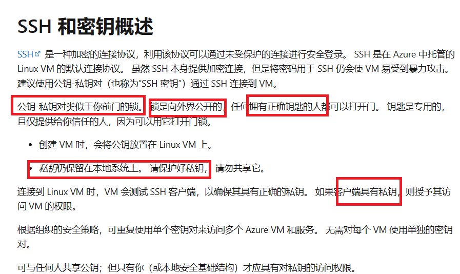

首先要配置好SSH这个比喻真的很形象！！！公钥是锁，私钥是钥匙！！！我手里有钥匙，但是可能可以开很多把锁！！！

[无法对 Azure Linux VM 使用 Ed25519 SSH 密钥 - Virtual Machines | Microsoft Learn](https://learn.microsoft.com/zh-cn/troubleshoot/azure/virtual-machines/ed25519-ssh-keys)

流汗，发现不是我的问题，是她真的不支持..

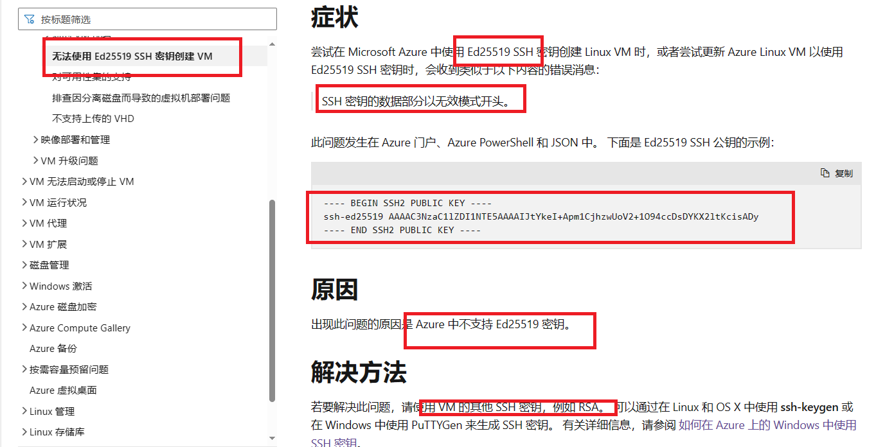

我这个ed-25519支持连接： nuc00, github

那就在创建一个rsa秘钥，来连接azure

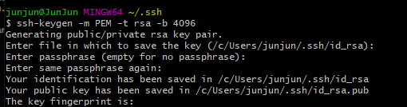

然后把公钥复制到azure门户中：

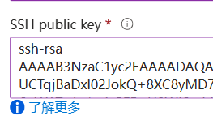

这就相当于我给azure的虚拟机的房门上配了一把专属于我自己的锁，只有我的私钥才能打开他！检测后发现，配置成功！能够使用ssh连接

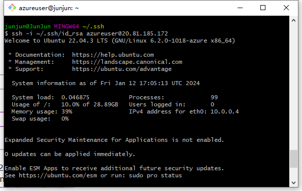

之前在初次连接的时候，config文件中没有配置从哪个端口登录，好像给vscode造成了困惑，然后通过vscode再次连接的时候就会报错，然后现在已经解决！

另一个问题在于:azure里面怎么管理用户组？我用azure cli是登录的928595这个号，然后我用vscode却是用azureuser登录的（这个好像是因为我在配置密码的时候使用了一下？

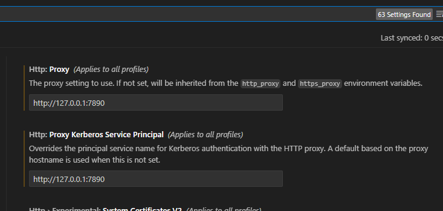

好像没有配置代理，导致我这比服务器断断续续的！错怪他了！误会解除！

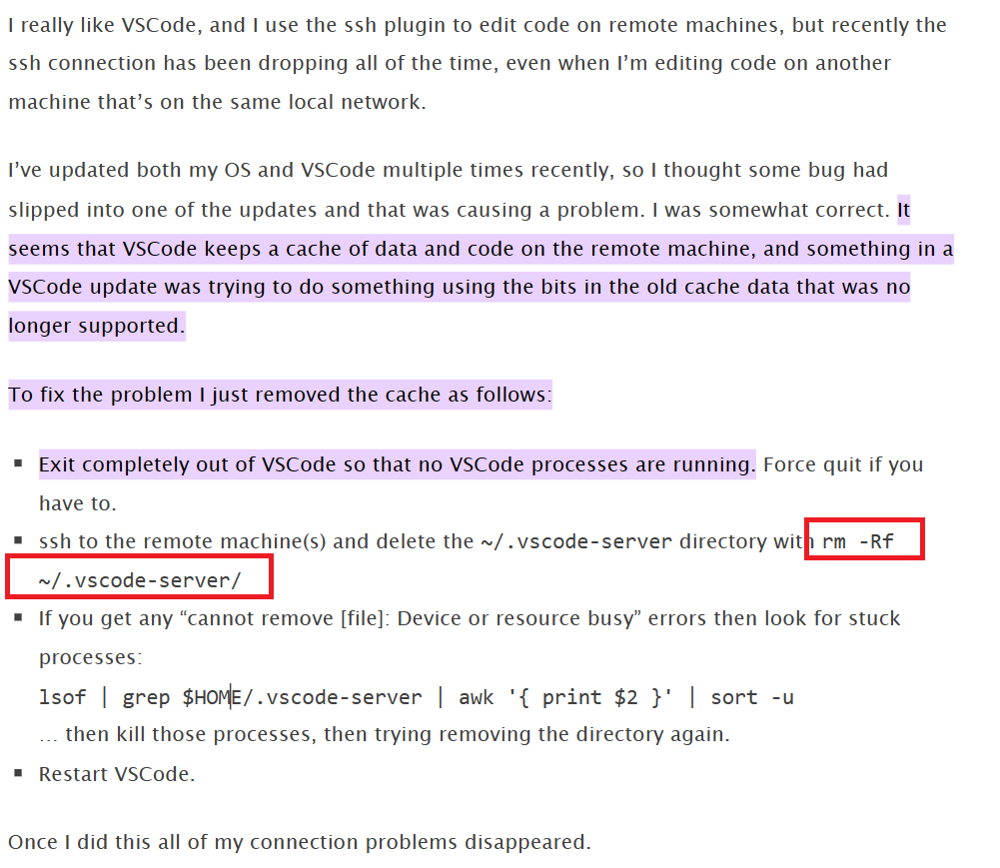

配置完代理还是有问题。。。尝试一下这个方法！


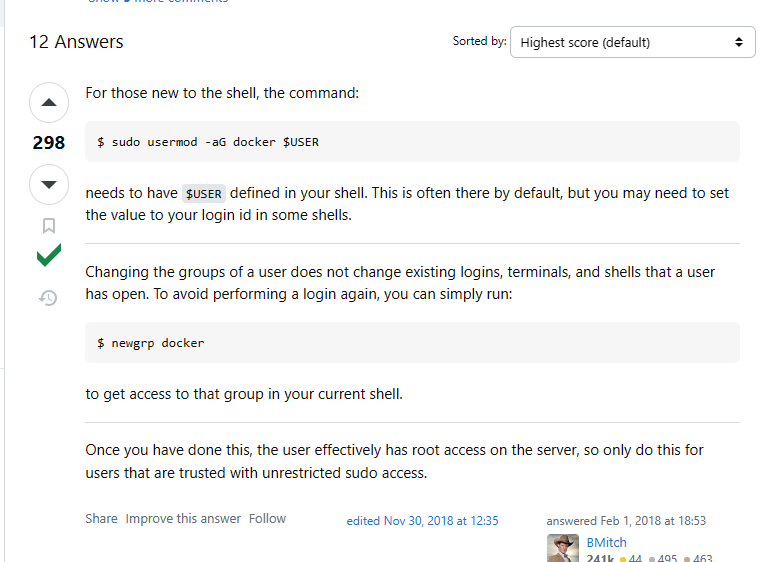

就这样解决啦！[linux - docker.sock permission denied - Stack Overflow](https://stackoverflow.com/questions/48568172/docker-sock-permission-denied/)

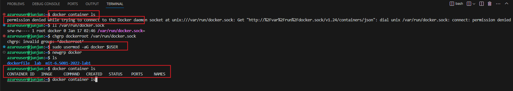


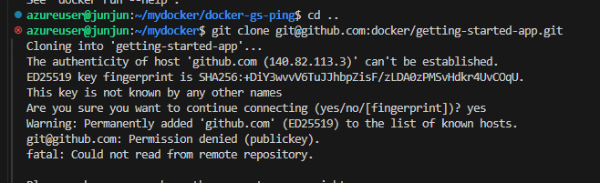

为什么突然不能用ssh来git clone了？

这是什么问题？认证问题！无法认证这个用户，可能是我gitconfig没有配置对

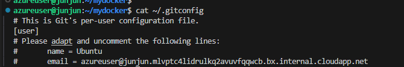这是我在azure上面的gitconfig的配置

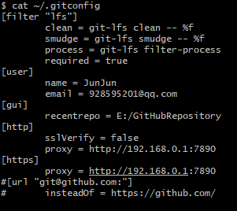

然后这个是我的本机配置

提到了一个概念：findgerprint? 指纹

首先有几个概念： public key , secret key这个已经搞懂了； 然后就是一个关于Authentic的问题：如果我希望访问我的git 仓库，是不是要在我的server写一个跟本机一样的私钥才行？不然怎么开github的门？钥匙总要配同一把吧？

对！这个思路没有问题，要不就多建几扇配套设施： 多套key-pair(sk,pk)对应多个服务器，要不就一把钥匙做很多个磨具


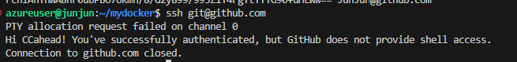

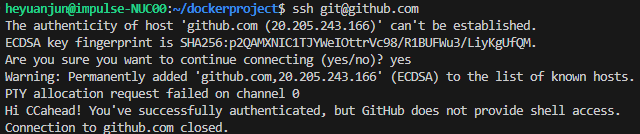

对嘛，这就对啦！

但是pc不知道为什么还是不能ssh通，这个再看

在查阅了N多个方法之后，终于在stackoverflow里面找到了一个属于我的方法！！！非常感谢他！！！


## 2.go MVC


我希望在容器内进行beego的开发，但是有个问题:我要在vscode内进入这个容器，我希望可视化它，就无法做到

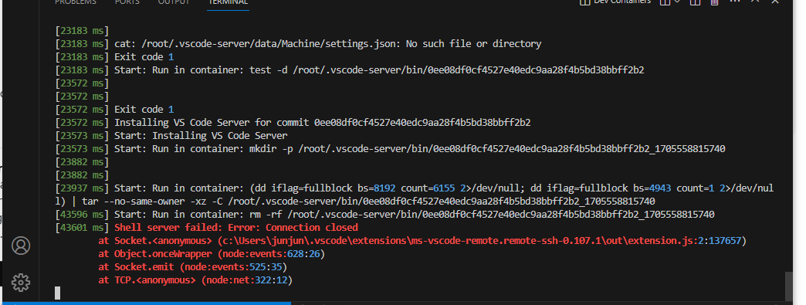

[[Remote-SSH Bug\]: "Dev Containers:Attach to Running Container" is not working in a specific server · Issue #9064 · microsoft/vscode-remote-release (github.com)](https://github.com/microsoft/vscode-remote-release/issues/9064)

查了一下，可能是这一笔issue，建议回滚版本


一开始没有指定端口映射规则，我在容器内启动了这个服务，但是还是没有办法从外部ip:8080的方式访问它，这时候我就查询gpt，他说要进行端口映射的配置工作，要有-p 8080:8080 这个步骤才行

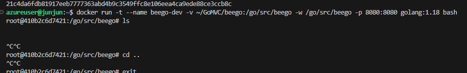

但是呢，现在又出现一个问题，我开启这个容器之后，我在容器内用bash会卡住！

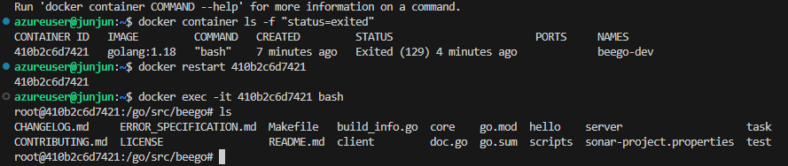

然后我就退出这个bash，又开了一个，但是我发现这个container已经关闭了，我就是用这个命令查找停止的container把他重启了，然后用docker exec -it .. bash进入他

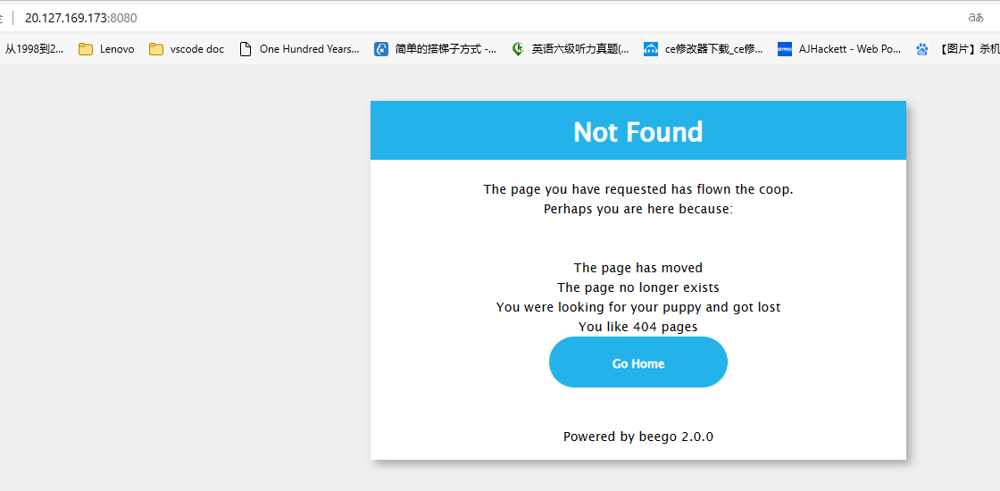

诶，是不是就可以看啦

# 关于sh.c的代码流程

fork1() 的工作原理
在 Unix 类操作系统中，fork() 系统调用用于创建一个新进程，称为子进程。这个子进程是父进程的副本。fork() 在父进程中返回新创建的子进程的 PID，在子进程中返回 0。

在你提供的 fork1() 函数中：

c
Copy code
int fork1(void) {
  int pid;

  pid = fork();
  if(pid == -1)
    panic("fork");
  return pid;
}
fork() 调用创建一个子进程。
如果 fork() 返回 -1，则表示进程创建失败，这时调用 panic("fork")。
对于成功的 fork() 调用，在父进程中返回子进程的 PID，在子进程中返回 0。
所以，当 fork1() 在子进程中被调用时，它返回 0。而在父进程中，它返回子进程的 PID。

子进程和父进程的行为
在你的代码片段中，父进程和子进程的行为由 if(fork1() == 0) 控制：

子进程：对于子进程，fork1() 返回 0，因此 if(fork1() == 0) 判断为真，子进程执行 runcmd(parsecmd(buf))。
父进程：对于父进程，fork1() 返回子进程的 PID，这是一个非零值。因此，if(fork1() == 0) 判断为假，父进程跳过 runcmd(parsecmd(buf)) 的执行，直接执行 wait(0)。
子进程不唤醒父进程
在 Unix 类操作系统中，父进程使用 wait() 系统调用来等待子进程结束。当子进程结束时（无论是正常退出还是发生错误），它会发送一个信号给父进程。父进程在接收到这个信号后，从 wait() 返回，继续执行后面的代码。

在你的 runcmd 函数中，没有直接的代码来“唤醒”父进程。父进程的 wait(0) 调用在子进程结束时自动返回，这是由操作系统内核管理的。换句话说，子进程的结束本身就是父进程继续执行的信号。

结论
子进程和父进程在 fork1() 调用后执行不同的代码路径，这是通过检查 fork1() 的返回值来实现的。
子进程执行完毕后，操作系统内核会通知父进程，使得父进程从 wait() 返回，无需子进程显式进行任何唤醒操作。


虽然没有在用户层面进行PV操作，但是这个wait跟acquire? 应该是出现在内核层面的： children执行完，awake parent


```c
int open(char *file, int flags) Open a file; flags indicate read/write; returns an fd (file descriptor).
int write(int fd, char *buf, int n) Write n bytes from buf to file descriptor fd; returns n.
int read(int fd, char *buf, int n) Read n bytes into buf; returns number read; or 0 if end of file.
int close(int fd) Release open file fd.
int dup(int fd) Return a new file descriptor referring to the same file as fd.
int pipe(int p[]) Create a pipe, put read/write file descriptors in p[0] and p[1].
i

for(;;){
n = read(0, buf, sizeof buf);
if(n == 0)
break;
if(n < 0){
fprintf(2, "read error\n");
13
exit(1);
}
if(write(1, buf, n) != n){
fprintf(2, "write error\n");
exit(1);
}
}

char *argv[2];
argv[0] = "cat";
argv[1] = 0;
if(fork() == 0) {
close(0);
open("input.txt", O_RDONLY);
exec("cat", argv);
}
```

### 关于几个常用的函数的理解：

#### 1.write(1,buf,size of buf)

这个函数很有趣，这里的1是指标准输出文件，我的代码是这样：

```c
#include "kernel/types.h"
#include "user/user.h"

int main(){

    write(1,"hello ",6);
    write(1,"world\n",6);
    exit(0);
}
```

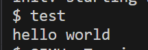

他就会给我在这个description为1的标准输出文件中写一个hello，然后他还会自动控制off set ，把这个world写到hello空格 之后诶

那这个dup操作是什么呢？close操作是什么呢？都试试看！

```c
int main(){
    write(1,"hello ",6);
    int fd=dup(1);
    write(fd,"world\n",6);
    exit(0);
}他相当于会给我一个文件描述符的拷贝，之后我做的任何操作都在这个文件上
```

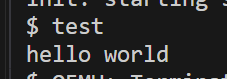

同样会返回一个结果

#### 2.close() 

参见这个文档


[Input-output system calls in C | Create, Open, Close, Read, Write - GeeksforGeeks](https://www.geeksforgeeks.org/input-output-system-calls-c-create-open-close-read-write/)

**Read from stdin => read from fd 0**: Whenever we write any character from the keyboard, it reads from stdin through fd 0 and saves to a file named /dev/tty.
**Write to stdout => write to fd 1**: Whenever we see any output to the video screen, it’s from the file named /dev/tty and written to stdout in screen through fd 1.
**Write to stderr => write to fd 2**: We see any error to the video screen, it is also from that file write to stderr in screen through fd 2.

相当于每一次打开进程都会把标准输入输出、以及标准err打开：他们的标识符fd就是0,1,2

```c
// C program to illustrate close system Call 
#include<stdio.h> 
#include<fcntl.h> 
int main() 
{ 
    // assume that foo.txt is already created 
    int fd1 = open("foo.txt", O_RDONLY, 0); 
    close(fd1); 
     
    // assume that baz.tzt is already created 
    int fd2 = open("baz.txt", O_RDONLY, 0); 
     
    printf("fd2 = % d\n", fd2); 
    exit(0); 
} 
```

这一段的描述如下：

Here, In this code first open() returns **3** because when the main process is created, then fd **0, 1, 2** are already taken by **stdin**, **stdout,** and **stderr**. So the first unused file descriptor is **3** in the file descriptor table. After that in close() system call is free it these **3** file descriptors and then set **3** file descriptors as **null**. So when we called the second open(), then the first unused fd is also **3**. So, the output of this program is **3**.

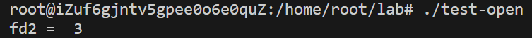

但是我稍加修改，比如我先关闭close(0)，把标准输入关闭了，那最小的fd就是0，如果要打开文件的话，他会使用这个最小的，不使用的fd：0开始使用

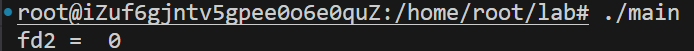

问题，如果我有子进程呢？怎么办呢？比如我这样写一个代码

```c
#include<stdio.h>
#include<fcntl.h>
#include <stdlib.h>
#include <unistd.h>
int main()
{
    close(0);
    // assume that foo.txt is already created 
    int fd1 = open("foo.txt", O_RDONLY, 0);
    close(fd1);

    // assume that baz.tzt is already created 
    int pid=fork();
    if(pid==0){<------------儿子执行
       int fd2 = open("baz.txt", O_RDONLY, 0);

    printf("fd2-children = % d\n", fd2);
    }<---------------这一段是儿子执行的
    int fd2 = open("baz.txt", O_RDONLY, 0); <----这里是父子都可以用

    printf("fd2-parents = % d\n", fd2);
    exit(0);
}
```

在fork前，被占用的fd:是1,2（因为fd1虽然占用了一小会fd=0，但是他申请关闭了，所以recent unused应该是fd=0）；在fork后，所有的数据都会被拷贝到child，包括文件标识符的状态，此时父子俩都应该是1,2被使用，其他的是好的；提问，每个进程对应的stdin,stdout,stderr不一样吗？

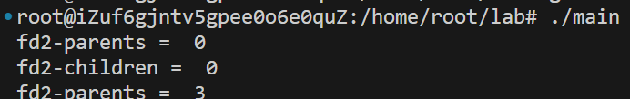

所以执行应该是：父亲在执行完fork之后，直接执行int fd2 = open("baz.txt", O_RDONLY, 0);这一行，然后打印，那这个时候肯定是**fd2-parents = 0**；而对于儿子来说：先执行了if内的子进程专属的代码，然后分配了fd=0给专属片段；然后下面这一段没有规定父子关系，父子都能用！所以他又打开了一次，再次分配了一个unused，就是fd=3

改一下代码，

```c
int pid=fork();
    if(pid==0){<------------儿子执行
       int fd2 = open("baz.txt", O_RDONLY, 0);

    printf("fd2-children = % d\n", fd2);
    }<---------------这一段是儿子执行的
    else{int fd2 = open("baz.txt", O_RDONLY, 0); <----这里是父用

    printf("fd2-parents = % d\n", fd2);
    exit(0);
    }
```

[Wait System Call in C - GeeksforGeeks](https://www.geeksforgeeks.org/wait-system-call-c/)

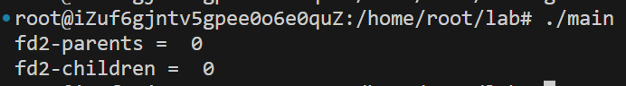

加一段：wait，让父亲等儿子

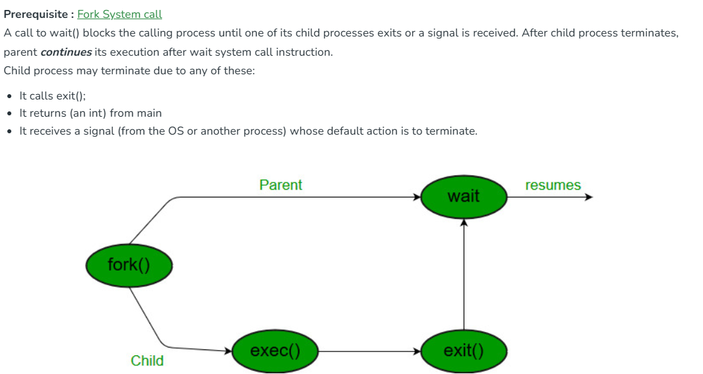

关于close的这个问题还没有解决，比如close一个值，怎么打开呢？read,write不能直接打开吗？


Lec3 

OS 要够强壮

App cannot crash OS, either break out of its isolation

Who knows its kernel mode or user mode? Processor has a bit identifying which is the kernel or user: 1 stands for user, and 0 stands for kernel

User             Kernel 

sys_fork ->  syscall -> fork

引入了一个概念： kernel 就是trust computing base

shell：talks to filesystem


# 11.how to use gdb debug

Type "apropos word" to search for commands related to "word".
warning: File "/home/root/lab/mit-6.S081-2022-lab1/.gdbinit" auto-loading has been declined by your `auto-load safe-path' set to "$debugdir:$datadir/auto-load".
To enable execution of this file add
        add-auto-load-safe-path /home/root/lab/mit-6.S081-2022-lab1/.gdbinit
line to your configuration file "/root/.config/gdb/gdbinit".
To completely disable this security protection add
        set auto-load safe-path /
line to your configuration file "/root/.config/gdb/gdbinit".

就是说：由于gdb的安全策略，用户的gdb调试文件被拒绝加入到auto-load safe-path

我的办法，在~/.gdbinit中加入这个文件的内容